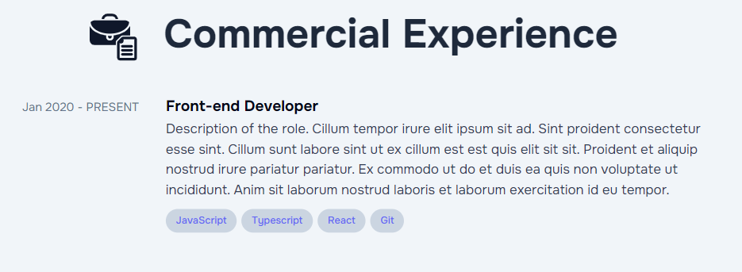
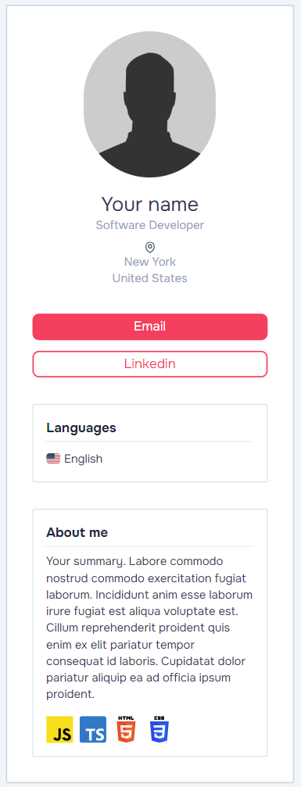
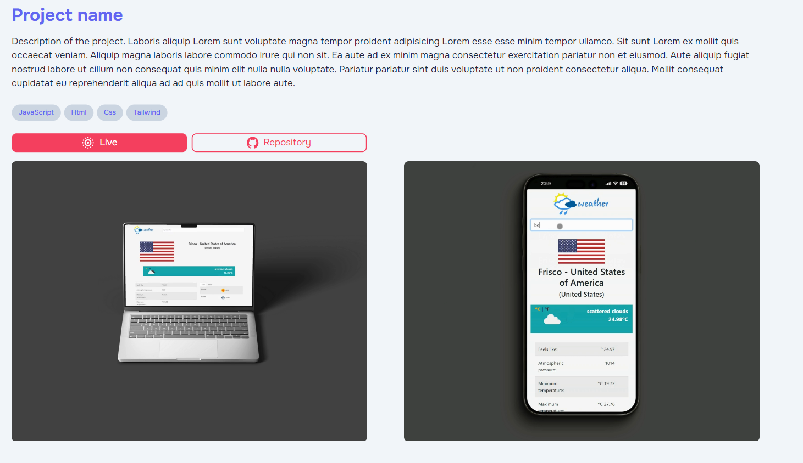

# Developer Portfolio

## Set Up

### 1. Install dependencies.

-   Node Js: v18.14.1 or later.

### 2. Run the following command in the project root.

```sh
pnpm i
```

### 3. Prepare your data, examples are provided in each file, replace them with yours.

```text
/
├── public/
│   └── profile.jpeg
│	└── subheader.jpeg
└──src/
    └── data/
        └── experience.ts
        └── profile.ts
        └── projects.ts
```

#### 1. Place your profile photo in /public/profile.jpeg

#### 2. Place your subheader photo in /public/subheader.jpeg

#### 3. Insert your experience

/src/data/experience.ts

```
export const EXPERIENCES: Experience[] = [
	{
		date: 'Jan 2020 - PRESENT',
		title: 'Front-end Developer',
		description: "Description of the role. Cillum tempor irure elit ipsum sit ad. Sint proident consectetur esse sint. Cillum sunt labore sint ut ex cillum est est quis elit sit sit. Proident et aliquip nostrud irure pariatur pariatur. Ex commodo ut do et duis ea quis non voluptate ut incididunt. Anim sit laborum nostrud laboris et laborum exercitation id eu tempor.",
		tags: [
			'JavaScript',
			'Typescript',
			'React',
			'Git'
		]
	}
	//...add more experience
]
```

#### 4. Insert your profile

/src/data/profile.ts

```
export const PROFILE = {
	name: 'Your name',
	position: 'Software Developer',
	location: {
		city: 'New York',
		country: 'United States',
	},
	languages: [
		Language.ENGLISH
	],
	aboutMe: [
		'Your summary. Labore commodo nostrud commodo exercitation fugiat laborum. Incididunt anim esse laborum irure fugiat est aliqua voluptate est. Cillum reprehenderit proident quis enim ex elit pariatur tempor consequat id laboris. Cupidatat dolor pariatur aliquip ea ad officia ipsum proident.'
	],
	email: 'youremail@gmail.com',
	linkedinLink: 'https://www.linkedin.com/in/your-profile',
	tools: new Set([
		Tool.JAVASCRIPT,
		Tool.TYPESCRIPT,
		Tool.HTML,
		Tool.CSS,
	])
}
```

#### 5. Insert your projects

/src/data/projects.ts

```
export const PROJECTS: Project[] = [
	{
		projectId: '1',
		title: 'Developer Portfolio',
		description: [
			"Description of the project. Laboris aliquip Lorem sunt voluptate magna tempor proident adipisicing Lorem esse esse minim tempor ullamco. Sit sunt Lorem ex mollit quis occaecat veniam. Aliquip magna laboris labore commodo irure qui non sit. Ea aute ad ex minim magna consectetur exercitation pariatur non et eiusmod. Aute aliquip fugiat nostrud labore ut cillum non consequat quis minim elit nulla nulla voluptate. Pariatur pariatur sint duis voluptate ut non proident consectetur aliqua. Mollit consequat cupidatat eu reprehenderit aliqua ad ad quis mollit ut labore aute."
		],
		tags: [
			'JavaScript',
			'Html',
			'Css',
			'Tailwind',
		],
		desktopMedia: ['/demo/desktop.mp4'],
		phoneMedia: ['/demo/phone.mp4'],
		liveLink: 'https://google.com',
		repositoryLink: 'https://github.com/',
		isActive: true
	}
	//...add more projects
]
```

#### 6. Visual result





### 4. Check the results

#### 1. Run the following command

```sh
pnpm run start
```

#### 2. Navigate to

localhost:4321

### 5. Prepare your project for production

#### 1. Run the following commands

```sh
pnpm run build
```

```sh
pnpm run preview
```

Your production-ready code will be located in "/dist"

#### 3. Check the production result by navigating to

localhost:4321

## 🧞 All Commands

All commands are run from the root of the project, from a terminal:

| Command                    | Action                                           |
| :------------------------- | :----------------------------------------------- |
| `pnpm install`             | Installs dependencies                            |
| `pnpm run start`           | Starts local dev server at `localhost:4321`      |
| `pnpm run build`           | Build your production site to `./dist/`          |
| `pnpm run preview`         | Preview your build locally, before deploying     |
| `pnpm run astro ...`       | Run CLI commands like `astro add`, `astro check` |
| `pnpm run astro -- --help` | Get help using the Astro CLI                     |
